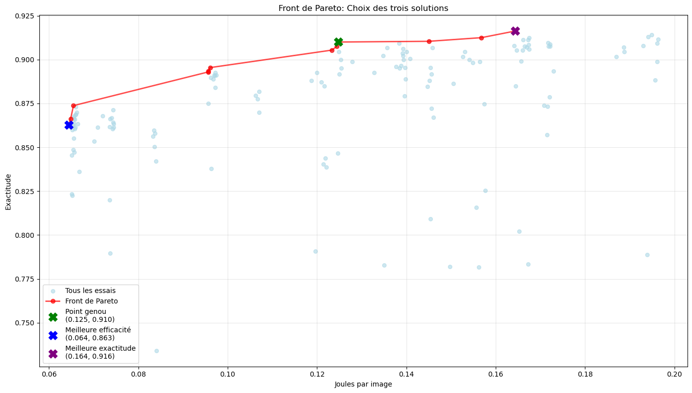
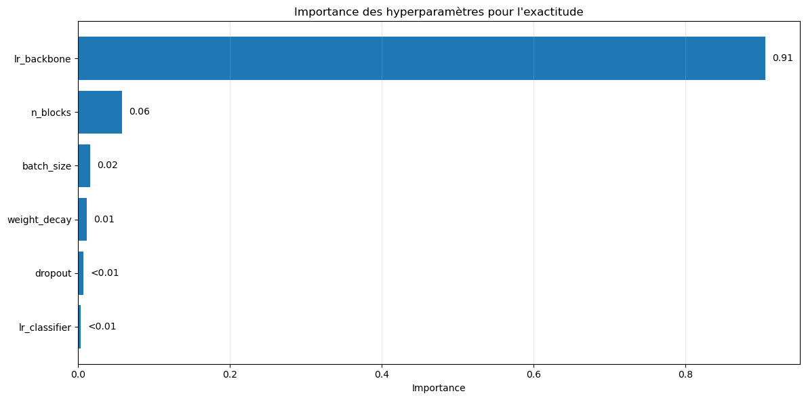

# M60HD-Experiment

Expérimentation issue de mon mémoire de master en computer science (Université de Namur) portant sur l’optimisation multiobjectif des hyperparamètres d’un CNN pour concilier exactitude (accuracy) et efficacité énergétique (J/image).

## Contenu du repo

```text
.
├── M60HD.pdf                   # Le mémoire de recherche au format PDF
├── README.md                   # Fichier README principal (français)
├── README_EN.md                # Fichier README en anglais
├── power_logger.py             # Script pour le suivi de la consommation d'énergie du GPU
├── requirements.txt            # Dépendances Python du projet
├── results/                    # Dossier contenant les graphiques et résultats visuels
│   ├── front_pareto_result.png
│   ├── hp_importance_eff.png
│   ├── hp_importance_ex.png
│   ├── pareto_front_retrained.png
│   └── pareto_front_selection.png
├── setup.sh                    # Script d'installation des dépendances
└── stanforddogs_exp.ipynb      # Notebook Jupyter contenant l'expérimentation principale
```

## Présentation du projet (Mémoire)

### Abstract

Dans un cadre de transfer learning sur CNN, ce mémoire étudie comment l’optimisation multiobjectif des hyperparamètres avec NSGA-II et Optuna permet de créer un front de Pareto exactitude-énergie et d’identifier un compromis adapté. L’espace de recherche couvre des hyperparamètres clés de l’entrainement comme le learning rate du backbone et du classifier, la weight decay, le dropout, la taille de batch et le nombre de blocs dégelés. L’analyse fANOVA met en évidence que l’énergie d’entraînement dépend surtout du nombre de blocs dégelés, avec près de 93&nbsp;% de la variance, tandis que l’exactitude est principalement déterminée par le learning rate du backbone, autour de 91&nbsp;%. Le front de Pareto observé est concave et présente des rendements décroissants. À mesure que l’exactitude augmente, l’efficacité énergétique diminue. Un point de genou atteint 98&nbsp;% de l’exactitude maximale tout en réduisant d’environ 31&nbsp;% l’énergie par image. La portée est volontairement limitée à un modèle et un jeu de données, et seule l’énergie d’entraînement est mesurée.

### Questions de recherche

Ce projet s’appuie sur deux questions centrales issues du mémoire :

1. **Construction d’un front de Pareto** :  
   Dans un cadre de transfer learning sur CNN, comment utiliser une optimisation multiobjectif pour construire un front de Pareto entre exactitude et efficacité énergétique, et comment ce front peut-il guider le choix d’un compromis adapté à un cas d’étude ?

2. **Importance des hyperparamètres** :  
   Quels hyperparamètres influencent le plus la position des solutions sur le front et comment les identifier de façon fiable pour aider la prise de décision ?

### Qu'est ce qu'un front de Pareto

Un front de Pareto représente l’ensemble des solutions non dominées d’un problème multiobjectif. Dans ce contexte, chaque point du front correspond à une configuration d’hyperparamètres pour laquelle il n’est pas possible d’améliorer l’exactitude sans augmenter l’énergie consommée, et vice versa.
Ce front permet de visualiser le compromis entre les deux objectifs et d’identifier la configuration d’hyperparamètres la plus adaptée selon les priorités business.

### Principaux résultats

L’optimisation multi-objectif avec NSGA-II (via Optuna) a permis de générer un front de Pareto illustrant le compromis entre exactitude et énergie consommée par image lors de l’entraînement.

- Le front obtenu est concave, révélant des rendements décroissants : au-delà d’un certain point, gagner en accuracy coûte proportionnellement plus d’énergie.
- Par exemple on observe qu’entre 0,06&nbsp;J/image et 0,10&nbsp;J/image, chaque augmentation de 0,04 J permet de gagner environ 2,5 points de pourcentage d'accuracy. En revanche, au-delà de 0,12&nbsp;J/image, ce même gain énergétique n’apporte plus qu’environ 0,6 point de pourcentage.
- Le point de genou identifié permet d’atteindre 98&nbsp;% de l’exactitude maximale tout en réduisant l’énergie d’entraînement d’environ 31&nbsp;%.
- Ce compromis est particulièrement intéressant pour les cas où la contrainte énergétique est forte.

<figure style="text-align: center;">
  
  <figcaption>Figure 1 :Chaque point bleu représente une configuration d’hyperparamètres évaluées. L’abscisse indique l’efficacité énergétique (J/image) et l’ordonnée l’exactitude top-1 (accuracy). Chaque point rouge correspond donc au front de Pareto et représente le meilleure compromis entre exactitude et efficacité énergétique.</figcaption>
</figure>

---

L’analyse fANOVA montre que :

- L’énergie dépend principalement du nombre de blocs dégelés (`n_blocks`) (≈ 93&nbsp;% de la variance), avec un impact secondaire de la batch size (`batch_size`).  
- L’exactitude dépend surtout du learning rate du backbone (`lr_backbone`) (≈ 91&nbsp;% de la variance).  

En pratique :  

- `n_blocks` influence l’axe horizontal (J/image) du front de Pareto, guidant les choix pour l’efficacité énergétique.  
- `lr_backbone` pilote l’axe vertical (exactitude), déterminant la performance prédictive.  




## Excuter le code

### Prérequis

- Machine avec GPU Nvidia compatible CUDA
- Docker installé

### Configuration de l'environnement

#### 1. Lancer le conteneur Docker

```bash
docker run -it --gpus all -v $(pwd):/workspace runpod/pytorch:2.8.0-py3.11-cuda12.8.1-cudnn-devel-ubuntu22.04
```
Sinon directement via runpod (payant): https://console.runpod.io

#### 2. Télécharger les données

Récupérer les fichiers depuis le dataset Stanford Dogs :

- **URL** : http://vision.stanford.edu/aditya86/ImageNetDogs/
- **Fichiers requis** :
  - `Images` (757 MB) - contient toutes les images
  - `lists` - contient la répartition train/test

#### 3. Installation

```bash
# Cloner le repository
cd /workspace/
git clone https://github.com/mathieu-plapied/M60-Experiment.git
cd M60-Experiment

# Organiser les données
mkdir -p data/
# Déplacer les dossiers Images/ et lists/ dans data/

# Exécuter le script de configuration
chmod +x setup.sh
./setup.sh
```

### Utilisation

Ouvrir le notebook Jupyter pour lancer l'expérience :

```bash
jupyter notebook stanforddogs_exp.ipynb
```