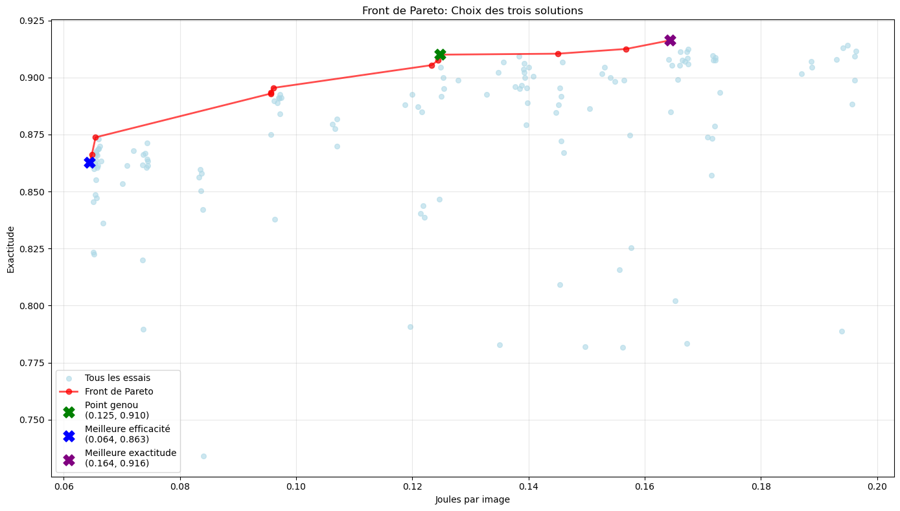
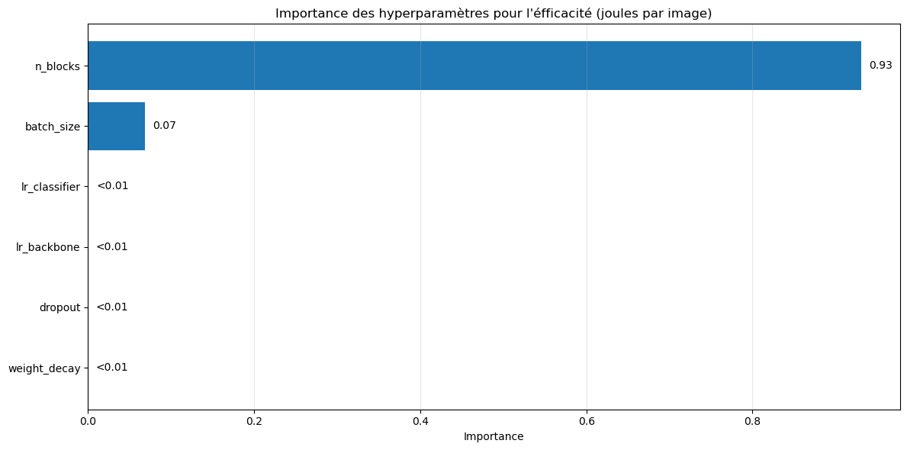
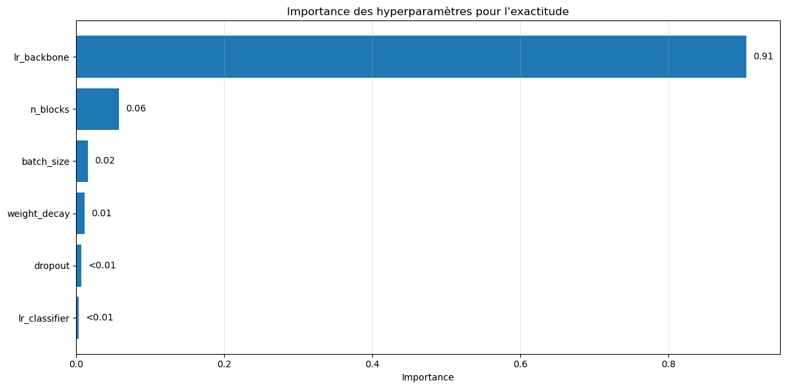

# M60HD-Experiment

> This README_EN.md was automaticaly translated from french to english by deepl and then corrected by myself.

Experiment from my master's thesis (University of Namur) on the multi-objective optimisation of CNN hyperparameters to reconcile accuracy and energy efficiency (J/image).

## Repo contents

```text
.
├── M60HD.pdf                   # Research thesis in PDF format
├── README.md                   # Main README file (French)
├── README_EN.md                # README file in English
├── power_logger.py             # Script for monitoring GPU energy consumption
├── requirements.txt            # Python dependencies for the project
├── results/                    # Folder containing graphs and visual results
│   ├── front_pareto_result.png
│   ├── hp_importance_eff.png
│   ├── hp_importance_ex.png
│   ├── pareto_front_retrained.png
│   └── pareto_front_selection.png
├── setup.sh                    # Dependency installation script
└── stanforddogs_exp.ipynb      # Jupyter notebook containing the main experiment
```

## Project overview (Thesis)

### Abstract

In a CNN transfer learning framework, this thesis studies how multi-objective optimisation of hyperparameters with NSGA-II and Optuna can be used to create a Pareto front of accuracy-energy and identify a suitable trade-off. The search space covers key training hyperparameters such as the learning rate of the backbone and classifier, weight decay, dropout, batch size, and number of unfrozen blocks. The fANOVA analysis highlights that training energy depends mainly on the number of unfrozen blocks, with nearly 93% of the variance, while accuracy is mainly determined by the learning rate of the backbone, around 91%. The observed Pareto front is concave and shows diminishing returns. As accuracy increases, energy efficiency decreases. A knee point reaches 98% of maximum accuracy while reducing energy per image by approximately 31%. The scope is deliberately limited to one model and one dataset, and only training energy is measured.

### Research questions

This project is based on two central questions from the thesis:

1. **Construction of a Pareto front** :  
 In a CNN transfer learning framework, how can multi-objective optimisation be used to construct a Pareto front between accuracy and energy efficiency, and how can this front guide the choice of a compromise suitable for a case study ?
2. **Importance of hyperparameters** :
   Which hyperparameters most influence the position of solutions on the frontier and how can they be reliably identified to aid decision-making ?

### What is a Pareto front?

A Pareto front represents the set of non-dominated solutions to a multi-objective problem. In this context, each point on the front corresponds to a hyperparameter configuration for which it is not possible to improve accuracy without increasing energy consumption, and vice versa.
This frontier allows us to visualise the trade-off between the two objectives and identify the most suitable hyperparameter configuration according to business priorities.

### Main results

Multi-objective optimisation with NSGA-II (via Optuna) generated a Pareto frontier illustrating the trade-off between accuracy and energy consumed per image during training.

- The resulting frontier is concave, revealing diminishing returns: beyond a certain point, gaining accuracy costs proportionally more energy.
- For example, we observe that between 0.06 J/image and 0.10 J/image, each increase of 0.04 J yields approximately 2.5 percentage points of accuracy. However, beyond 0.12 J/image, this same energy gain only yields approximately 0.6 percentage points.
- The identified knee point allows 98% of maximum accuracy to be achieved while reducing training energy by approximately 31%.
- This compromise is particularly interesting for cases where energy constraints are high.

<figure style="text-align: center;">

  <figcaption>Figure 1: Each blue point represents an evaluated hyperparameter configuration. The x-axis indicates energy efficiency (J/image) and the y-axis indicates top-1 accuracy. Each red point therefore corresponds to the Pareto front and represents the best compromise between accuracy and energy efficiency.</figcaption>
</figure>

---
The fANOVA analysis shows that:

- Energy depends mainly on the number of unfrozen blocks (`n_blocks`) (≈ 93% of the variance), with a secondary impact from the batch size (`batch_size`).
  
- Accuracy depends mainly on the learning rate of the backbone (`lr_backbone`) (≈ 91% of the variance).  
In practice:  
- `n_blocks` influences the horizontal axis (J/image) of the Pareto front, guiding choices for energy efficiency.
  
- `lr_backbone` drives the vertical axis (accuracy), determining predictive performance.

<figure style="text-align: center;">

<figcaption>Figure 2: Importance of hyperparameters on energy efficiency.</figcaption>
</figure>

<figure style="text-align: center;">

<figcaption>Figure 3: Importance of hyperparameters on accuracy.</figcaption>
</figure>

## Run the code
### Prerequisites
- Machine with CUDA-compatible Nvidia GPU
- Docker installed
### Environment setup
#### 1. Launch the Docker container
```bash
docker run -it --gpus all -v $(pwd):/workspace runpod/pytorch:2.8.0-py3.11-cuda12.8.1-cudnn-devel-ubuntu22.04
```
Alternatively, directly via runpod (paid): https://console.runpod.io
#### 2. Download the data
Retrieve the files from the Stanford Dogs dataset:
- **URL**: http://vision.stanford.edu/aditya86/ImageNetDogs/
- **Required files**:
  
- `Images` (757 MB) - contains all images
  - `lists` - contains the train/test split
#### 3. Installation
```bash
# Clone the repository
cd /workspace/
git clone https://github.com/mathieu-plapied/M60-Experiment.git
cd M60-Experiment
# Organise the data
mkdir -p data/
# Move the Images/ and lists/ folders to data/
# Run the setup script
chmod +x setup.sh
./setup.sh
```
### Usage
Open the Jupyter notebook to start the experiment:
```bash
jupyter notebook stanforddogs_exp.ipynb
```